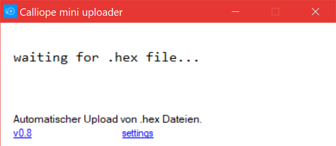

# Calliope.Uploader

Tired of drag and dropping .hex files to your [Calliope mini](https://calliope.cc/)? Use the **uploader** to automate it!

**Project is forked from [Microsoft TouchDevelop](https://github.com/Microsoft/TouchDevelop/tree/master/microbit/loader).** 

## [Documentation](https://www.touchdevelop.com/microbituploader)

## Notes

* Uploader uploads all *.hex* files to Calliope. 
* Tested with [PTX](http://pxt.calliope.cc/index.html) and [Open Roberta Lab](https://lab.open-roberta.org/).